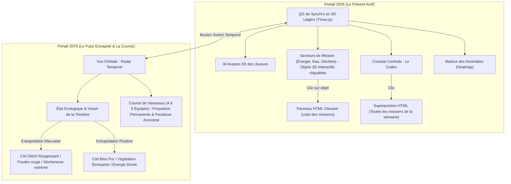

# Plan d'Implémentation - Evoe

Ce document définit l'architecture logicielle, les spécifications produit et le plan d'exécution technique pour l'adaptation de l'application *sosplanete-v2* vers l'univers science-fiction, coopératif et humoristique de **Evoe**.

---

## Choix d'Architecture : Intégration & Dockerisation

### Recommandation Technique d'Intégration
Il est recommandé d'**ajouter de nouvelles applications dans le projet existant `sosplanete-v2`** sous la forme d'une architecture monorepo hybride (TypeScript/Node.js + Python) :
1. **Réutilisation de la Base de Données (Single Source of Truth) :** Le modèle relationnel existant (`User`, `Team`, `Group`, `Child`, `ActionRef`, `LocalAction`, `ActionDone`, `Period`) stocké via Prisma correspond exactement aux besoins pour gérer le groupe de 30 joueurs, leurs équipes, leurs périodes et la saisie de leurs missions.
2. **Coexistence des frontends :** Nous créons un nouveau frontend dédié `apps/evoe-frontend` qui héberge l'interface utilisateur double univers, tandis que le backend actuel continue de tourner sans perturber `sosplanete-v1`.

### Configuration de Production et Docker
L'application **Evoe** doit tourner intégralement sous **Docker** pour garantir une portabilité et une stabilité en production sous Linux.
- **Docker Compose** existant dans `sosplanete-v2` sera enrichi avec deux nouveaux services :
  - `evoe-backend` : Conteneur Python (FastAPI/SQLModel) s'exécutant sur un environnement léger (image Alpine ou Slim).
  - `evoe-frontend` : Conteneur de service statique Nginx pour distribuer le frontend d'Evoe.
- Connexion sécurisée à la base PostgreSQL existante via des variables d'environnement partagées.

---

## Adaptation des Indicateurs Existants de sosplanete-v2

L'application d'administration actuelle de *sosplanete-v2* calcule déjà des statistiques d'avancement précieuses. Celles-ci seront récupérées, exposées par les endpoints Python, et habillées graphiquement dans Evoe pour coller à l'univers ludique :

| Indicateur Actuel | Adaptation Thématique dans Evoe | Rôle dans la Gamification |
| :--- | :--- | :--- |
| **Eco-Bar-Race** (Course des équipes) | **Le Radar de Course des Vaisseaux Temporels** | Représentation graphique dynamique en 2070. 4 à 6 équipes pilotent chacune leur propre vaisseau spatial. Leurs positions sur la Timeline dépendent du volume de missions validées. |
| **Top Enfant / Top Équipe** | **Le Tableau d'Intégrité du Nexus** | Classement des Watchmen (Gardiens) et de leurs équipes avec une esthétique premium en glassmorphism (voir section [Leaderboard](#leaderboard-visuel-détails)). Attribution de titres automatiques sur WhatsApp : *"Vigie Céleste"* pour le top 1, et *"Agent Dormant"* ou *"Passager Clandestin"* pour le retardataire de la semaine. |
| **Heatmap des Actions** | **La Matrice des Anomalies Temporelles** | Grille montrant les secteurs (Eau, Énergie, Déchets, Transport) où le groupe est le plus actif (secteurs "sécurisés" en vert/or) ou inactif (failles ou "anomalies" rougeoyantes à corriger). |

---

## Identité Visuelle & Expérience 3D : Le QG 2026 et la Timeline 2070

L'interaction utilisateur repose sur un switch temporel immédiat entre deux portails interactifs.



### 1. Le Portail 2026 (Le QG des Avatars & Saisie des Missions)
- **Le Concept** : Un QG de synchronisation épuré en 3D temps réel légère (développée via **Three.js** ou rendu 2.5D isométrique fluide), respectant la philosophie "antigravity" de légèreté et de performance.
- **Les Avatars 3D** :
  - Chaque joueur du groupe est représenté par un avatar 3D stylisé (style low-poly rétro-futuriste ou voxel amusant).
  - **États de synchronisation** : L'avatar exprime l'activité de la semaine. Si le joueur a validé ses éco-missions, son avatar s'active à l'écran (s'entraîne, brille d'une aura dorée). S'il a du retard, il montre des signes de fatigue ou de veille.
- **Visualisation et Saisie des Missions de la semaine** :
  1. **Les Secteurs Thématiques (Objets 3D Interactifs)** : La carte 3D intègre des éléments visuels cliquables représentant les thématiques écologiques. Cliquer sur un secteur déclenche l'apparition d'un **panneau latéral glissant** (drawer HTML semi-transparent flouté) listant les missions de cette catégorie.
  2. **Le Terminal Central "Codex des Missions"** : Au centre de la carte, une console holographique 3D clignotante est accessible. En cliquant dessus, une fenêtre de superposition (modal HTML) s'ouvre, présentant le tableau complet des missions de la semaine classées par onglets thématiques, idéal pour avoir une vue d'ensemble.
  3. **Raccourci de "Rapport de Mission" (Saisie Rapide)** : Un bouton flottant permanent "Rapport de Mission" en bas de l'écran ouvre instantanément la grille de saisie classique sans avoir besoin de manipuler la carte 3D.
- **Notification d'urgence** : Si une mission importante ou un défi d'équipe attend une validation, un point d'exclamation holographique doré flotte au-dessus de l'objet 3D correspondant sur la carte.

### 2. Le Portail 2070 (Le Paradoxe Ancestral & Le Radar de Course)
- **Le Concept du Paradoxe Ancestral** : Ce ne sont pas les joueurs de 2026 qui pilotent en 2070, mais leurs **descendants directs**. Si un joueur de 2026 ne valide pas ses missions de la semaine, il crée un paradoxe temporel. En conséquence, son descendant en 2070 subit un paradoxe et commence à s'effacer.
- **La Course des Équipes (4 à 6 équipes)** : Chaque équipe possède son propre vaisseau spatial visible sur le **Radar Temporel** de la Timeline (allant de 2026 à 2070).
- **Visuels et Animations des Vaisseaux** :
  * **Le vaisseau en tête** : File à pleine vitesse avec sa traînée lumineuse personnalisée. Ses membres d'équipage (les descendants de l'équipe) s'activent avec assurance à bord.
  * **Le vaisseau à la traîne** : Avance péniblement, enveloppé de fumée. Si des joueurs de cette équipe ont du retard sur leurs missions en 2026, on voit les hologrammes de leurs descendants **glitcher, clignoter et devenir translucides** à travers le cockpit.
  * **La Propulsion Permanente (Pas de retour arrière)** : C'est l'accumulation des missions chaque semaine qui change le futur. Une technologie de propulsion gagnée par une équipe est **acquise définitivement** (déblocage d'arbre technologique). Le vaisseau conserve sa nouvelle propulsion pour le reste du pilote.

---

## Les 5 Niveaux de Propulsion & Animations d'Évolution

Lorsqu'une équipe accumule un certain seuil historique de CO2 économisé et de missions validées, son vaisseau subit une **animation de transition technologique** majeure (effet d'onde de choc de distorsion, surbrillance dorée, éclatement de particules) et adopte un nouveau type de propulsion permanent :

| Niveau | Type de Propulsion | Visuel et Animation de Propulsion | Animation Spécifique de Transition (L'Évolution) |
| :--- | :--- | :--- | :--- |
| **N1** | **Friction Thermique** *(Charbon / Fioul spatial)* | Grosse fumée noire opaque, réacteurs crachant des étincelles orange/rouges, châssis métallique vibrant de façon instable. Pistons et tuyaux apparents qui bougent. | *Niveau initial par défaut.* |
| **N2** | **Voiles Photovoltaïques** *(Solaire / Vents Stellaires)* | Déploiement de deux grandes ailes solaires dorées semi-translucides. Traînée de vent solaire avec des particules bleu azur scintillantes. Le bruit de moteur rugueux cesse au profit d'un sifflement doux. | Les anciennes turbines à fioul se détachent et explosent en débris spatiaux, tandis que les voiles solaires se déploient en accordéon sous un flash de lumière dorée. |
| **N3** | **Fusion Magnétique** *(Tokamak / Nucléaire Propre)* | Rétractation des voiles. Un anneau d'énergie centrale violette oscillante apparaît à l'arrière du vaisseau. Vol parfaitement stable et traînée de plasma violette et rectiligne. | L'anneau de fusion se charge au centre du vaisseau, créant une onde de choc sphérique violette qui balaye l'écran et stabilise instantanément l'assiette du vaisseau. |
| **N4** | **Résonance Quantique** *(Énergie du Vide)* | Le vaisseau devient légèrement translucide. Il crée des micro-distorsions spatiales devant lui (effet de mirage / ondulations visuelles). Il se déplace par de légers bonds instantanés (micro-téléportations). | Le vaisseau se contracte sur lui-même puis subit une explosion de distorsion de l'espace-temps (effet de loupe gravitationnelle) avant de réapparaître 20 mètres plus loin avec une traînée de pixels quantiques. |
| **N5** | **Singularité Protonique** *(Trou Noir Artificiel)* | Des bras magnétiques à l'arrière maintiennent en rotation un micro-trou noir (sphère noire parfaite entourée d'un disque d'accrétion doré brillant). Le vaisseau courbe visiblement l'espace autour de lui et file à la vitesse de la lumière. | Le micro-trou noir s'ouvre dans un flash d'implosion gravitationnelle (effet de flash noir/blanc inversé qui aspire les particules environnantes), puis le vaisseau est propulsé en avant dans un cône de lumière blanche continue. |

---

## Leaderboard Visuel (Détails de l'Interface Premium)

Pour coller au visuel validé (mockup du Classement des Joueurs) :
- **Design du Panneau (Modal)** : Une carte avec effet de **glassmorphism** (fond blanc translucide, flou d'arrière-plan `backdrop-filter: blur(16px)` et bordure fine blanche semi-transparente). Les coins sont faiblement arrondis (ex: `border-radius: 8px`). Un bouton de fermeture rond gris clair avec un symbole `X` est positionné en haut à droite. Le titre "Classement des Joueurs" est précédé d'un badge carré jaune orangé contenant une icône de trophée dorée.
- **Le Podium (Top 3)** :
  - **1ère Place (Centre)** : Surélevée, grand avatar circulaire entouré d'une bordure dorée brillante et surmonté d'une petite couronne d'énergie. Badge jaune '1' au pied de l'avatar. Pseudo et volume de missions en couleur dorée dans une carte blanche/jaune dédiée.
  - **2ème Place (Gauche)** : Légèrement plus basse, bordure argentée avec le badge '2'. Pseudo et volume de missions dans une carte grise/bleue.
  - **3ème Place (Droite)** : Plus basse, bordure bronze/orange avec le badge '3'. Pseudo et volume de missions dans une carte orange clair.
  - **Expressions des Avatars** : Les avatars du podium expriment leur humeur selon leur position (ex: déterminé/hargneux pour le 1er, yeux en cœur pour le 2ème, en pleurs/triste pour le 3ème).
- **Le Reste du Classement (Rangs #4+)** :
  - Présenté sous forme de lignes horizontales avec un fond légèrement translucide blanc.
  - Chaque ligne contient : le rang (ex: `#4`), l'avatar circulaire du joueur avec son expression, son pseudo en minuscules (ex: `dinosaure`, `chêne`), une **jauge de progression horizontale verte** montrant son niveau d'activité, et le nombre de missions en gras suivi du label "ACTIONS" ou "MISSIONS" en petites majuscules grisées.

---

## Plan des 4 Sprints (User Stories Agile & Détails Techniques)

### Sprint 1 : Habillage et Univers de Science-Fiction (Double Portail & Codex) - **[RÉALISÉ]**
*Objectif : Mettre en place la dualité d'univers, le catalogue de missions SF, et la représentation des descendants sous forme d'avatars glitchant en cas de retard.*

#### US 1.1 : Le Codex Temporel (Mappage SF) - **[RÉALISÉ]**
**En tant que** Watchman,  
**Je veux** que mes éco-missions quotidiennes de 2026 soient présentées sous forme de missions de science-fiction (ex: "Activer le Bouclier Thermique Passif" pour baisser le chauffage),  
**Afin de** m'immerger avec humour dans l'effort de guerre temporel de l'an 2070.

*   **Détails de l'implémentation technique** :
    - **Base de données** : Ajout d'une table `EvoeMissionTranslation` liée à `ActionRef` qui mappe l'action classique vers un titre de mission SF (`sfTitle`) et une description immersive (`sfDescription`).
    - **Backend (Python / FastAPI)** : Création d'un endpoint `GET /api/v1/missions` qui interroge la base PostgreSQL et retourne le catalogue fusionné (Données physiques réelles + Enrobage SF).
    - **Dockerisation** : Configuration du conteneur `evoe-backend` avec rechargement automatique à chaud.
*   **Interface Graphique (UI/UX - Le Portail 2026)** :
    - Présentation claire des missions réelles sur fond clair.
    - Survol d'une mission : un effet "hologramme" projette sa traduction SF (version 2070) avec une animation d'ouverture fluide.
*   **Critères d'acceptation (BDD)** :
    - *Étant donné que* je suis connecté sur Evoe,
    - *Quand* je consulte le catalogue des missions de la semaine,
    - *Alors* je vois s'afficher "Activer le Bouclier Thermique Passif" en surimpression de "Baisser le chauffage de 1°C".

#### US 1.2 : Le Nexus Temporel & Les Avatars Glitchés (Le Paradoxe Ancestral) - **[RÉALISÉ]**
**En tant que** Watchman,  
**Je veux** basculer entre le Portail 2026 de synchronisation et le Portail 2070 montrant la course de vaisseaux et les descendants,  
**Afin de** constater l'effet de mes missions sur la présence de mon descendant dans le futur.

*   **Détails de l'implémentation technique** :
    - **Frontend (Three.js & Canvas)** : Intégration d'un canvas WebGL léger dans le frontend. Gestion des avatars à l'aide de primitives 3D stylisées et optimisées pour le chargement instantané.
    - **Algorithme de Glitch des Avatars** : Script Three.js appliquant un shader de glitch (scintillement, décalage de canaux RVB, transparence intermittente) sur l'avatar du descendant si le joueur n'a pas validé ses missions hebdomadaires.
    - **Backend (Python)** : Endpoint `GET /api/v1/dashboard/status` retournant l'état de complétion et le niveau de pollution temporelle.
*   **Interface Graphique (UI/UX)** :
    - **Portail 2026 (Clair)** : QG virtuel montrant les 30 avatars 3D des copains qui s'agitent, ou s'entraînent selon leur score. Cliquer sur les objets 3D (éolienne, purificateur d'eau, console centrale) ouvre le menu d'enregistrement des missions de la semaine.
    - **Portail 2070 (Sombre -> Lumineux)** : Radar spatial montrant la course. Cliquer sur le vaisseau de son équipe permet de voir les descendants de son équipe s'activer ou glitcher/disparaître s'ils n'ont pas validé leurs missions.
*   **Critères d'acceptation (BDD)** :
    - *Étant donné que* je clique sur le bouton "Switch Temporel",
    - *Quand* la transition s'active,
    - *Alors* l'interface bascule du QG 2026 clair avec les avatars 3D vers la vue orbitale 2070 avec les vaisseaux et le statut des descendants.

---

### Sprint 2 : Le Moteur d'Extrapolation & Les Technologies de Propulsion - **[RÉALISÉ]**
*Objectif : Coder le moteur de projection mathématique et restituer visuellement la course des vaisseaux avec leurs propulsions permanentes.*

#### US 2.1 : L'Algorithme de Projection Micro -> Macro - **[RÉALISÉ]**
**En tant que** Concepteur Scientifique,  
**Je veux** extrapoler l'impact cumulé de notre groupe de 30 copains à l'échelle de la population française (68 millions d'habitants),  
**Afin de** simuler l'impact de nos comportements s'ils devenaient la norme nationale en 2070.

*   **Détails de l'implémentation technique** :
    - **Logique backend (Python)** : Formule d'extrapolation temporelle et géographique :
      $$\text{Impact Extrapolé} = \frac{\text{Cumul Groupe (kg CO2e)}}{\text{Membres Actifs (30)}} \times 68\,000\,000 \text{ hab} \times 52 \text{ semaines}$$
    - **Traduction en métriques amusantes/parlantes** :
      - *Glace sauvée* : $1 \text{ kg CO2e économisé} \approx 3 \text{ kg de banquise préservée}$ (Source GIEC).
      - *Forêt sauvée* : Surface équivalente en terrains de football.
    - **Endpoint API** : `GET /api/v1/extrapolation/metrics`.
*   **Interface Graphique (UI/UX)** :
    - Des cartes d'impact animées en 2070. Si les économies sont insuffisantes, la banquise fond à l'écran. Si l'extrapolation est bonne, la banquise s'étend avec une transition fluide et lumineuse.
*   **Critères d'acceptation (BDD)** :
    - *Étant donné que* le groupe a économisé 150 kg de CO2 cette semaine,
    - *Quand* je consulte le moteur de projection,
    - *Alors* l'application affiche la surface de banquise préservée à l'échelle nationale.

#### US 2.2 : La Course de Vaisseaux & Évolution Permanente de la Propulsion - **[RÉALISÉ]**
**En tant que** Membre d'une Équipe,  
**Je veux** visualiser notre vaisseau rivaliser avec les autres sur le Radar Temporel, et le voir évoluer de façon permanente vers de nouvelles propulsions,  
**Afin de** motiver mon équipe à débloquer des technologies futures et distancer les autres.

*   **Détails de l'implémentation technique** :
    - **Récupération des indicateurs** : Le backend Python requête la table `EcoBarRaceSnapshot` (classement) et les tables `ActionDone` jointes aux catégories.
    - **Sauvegarde de la technologie de propulsion** : Table `EvoeTeamTechnology` qui enregistre le niveau maximal de propulsion débloqué pour chaque équipe. Ce niveau ne peut jamais régresser.
    - **Endpoints API** :
      - `GET /api/v1/dashboard/vessel-race` : Retourne la vitesse, la position sur la Timeline, le niveau de propulsion de chaque vaisseau, et si des membres d'équipage (descendants) sont actuellement en train de glitcher.
*   **Interface Graphique (UI/UX)** :
    - **Radar Temporel 2070** : Affiche les 4 à 6 vaisseaux. Au moment du franchissement d'un seuil de niveau de propulsion, déclenchement d'une animation d'évolution technologique en plein écran pour les membres de l'équipe (effet de flash d'implosion, particules, déploiement des voiles ou chargement du trou noir).
    - Les vaisseaux conservent visuellement leur niveau de propulsion atteint (N1 à N5) avec les effets de traînée associés (fumée, voiles d'or, plasma violet, distorsion quantique ou disque d'accrétion de trou noir).
*   **Critères d'acceptation (BDD)** :
    - *Étant donné que* mon équipe a franchi le seuil requis pour le Niveau 3 (Fusion Magnétique),
    - *Quand* je me connecte au Portail 2070,
    - *Alors* le système joue l'animation de transition de l'anneau de plasma violet, et notre vaisseau conserve définitivement cette propulsion, même si nos scores de la semaine suivante baissent.

---

### Sprint 3 : Intégration WhatsApp, Défis & Leaderboard Premium - **[PARTIELLEMENT RÉALISÉ]**
*Objectif : Connecter le jeu au canal de communication existant pour stimuler les taquineries et intégrer le leaderboard premium en glassmorphism.*

#### US 3.1 : Le Système de Défis "Distorsion Temporelle" (PVP Coopératif) - **[RÉALISÉ]**
**En tant que** Membre de l'Équipe A,  
**Je veux** défier l'Équipe B à accomplir une mission thématique spécifique (ex: "Défi 0 viande pendant 3 jours"),  
**Afin de** booster notre jauge de timeline commune tout en mettant amicalement la pression à mes amis.

*   **Détails de l'implémentation technique** :
    - **Modèle de Données** : Table `EvoeChallenge` (`challengerTeamId`, `targetTeamId`, `title`, `description`, `status`, `pledge` (gage, ex: "Payer l'apéro"), `startDate`, `endDate`).
    - **Points d'entrée d'API** :
      - `POST /api/v1/challenges` : Créer un défi.
      - `POST /api/v1/challenges/{id}/respond` : Accepter ou refuser.
      - `POST /api/v1/challenges/{id}/verify` : Validation de la réussite/échec.
*   **Interface Graphique (UI/UX)** :
    - Écran "Distorsion Temporelle" au style d'un parchemin de duels holographique. Les défis clignotent avec un compte à rebours sous forme de sablier futuriste.
*   **Critères d'acceptation (BDD)** :
    - *Étant donné que* mon équipe a lancé un défi végétarien de 3 jours à l'Équipe B et qu'ils ont accepté,
    - *Quand* le délai expire et que 100% des membres de l'Équipe B n'ont pas enregistré leurs repas végétariens,
    - *Alors* le statut du défi passe à "Échoué" et l'application affiche le gage : "L'Équipe B doit payer l'apéro au groupe !".

#### US 3.2 : Le Chrono-Messager WhatsApp & Leaderboard Premium - **[PARTIEL]**
*   **Leaderboard Premium** : **[RÉALISÉ]** (Intégration du classement premium en glassmorphism et podium stylisé).
*   **Chrono-Messager WhatsApp** : **[À FAIRE]** (Script ou service d'envoi automatique de rapports).
**En tant que** Joueur,  
**Je veux** consulter un leaderboard premium et recevoir des résumés hebdomadaires automatiques et humoristiques sur WhatsApp,  
**Afin de** me mesurer aux autres joueurs et rigoler des performances de chacun.

*   **Détails de l'implémentation technique (WhatsApp)** :
    - **Générateur de Messages (Python)** : Script planifié (cron) extrayant le statut de la Timeline, le classement des vaisseaux, les descendants glitchant en 2070 et les vainqueurs/perdants.
    - **Paramétrage des Canaux** : Intégration de champs de configuration en base de données pour lister les webhooks et les liens d'invitation des groupes WhatsApp (un canal général pour tout le groupe de joueurs configuré, et un canal privé par équipe).
    - **Script Python (`weekly_whatsapp_report.py`)** :
      ```python
      def generate_humorous_report(stats):
          # Message personnalisé avec le jargon SF et le concept du paradoxe ancestral
          if stats['glitching_descendants']:
              names = ", ".join([f"@{p['pseudo']}" for p in stats['glitching_descendants']])
              return f"🚨 ALERTE PARADOXE TEMPOREL 🚨\n\nWatchmen, la Timeline vacille ! En 2070, les descendants de {names} sont en train de s'effacer du cockpit de leur vaisseau à cause de missions oubliées en 2026... 🧬🔌\n\nPendant ce temps, l'équipe '{stats['leading_team']}' a débloqué la Propulsion Quantique 🚀✨.\n\nStatut global de la Timeline : {stats['stability_percentage']}%. Remplissez vos Codex !"
      ```
*   **Interface Graphique (UI/UX)** :
    - **Intégration du Leaderboard Premium** : Implémentation exacte du panneau en glassmorphism avec son podium d'avatars expressifs (1er déterminé, 2e avec coeurs, 3e en pleurs), et les lignes horizontales avec jauges vertes pour les rangs inférieurs (s'adaptant dynamiquement au nombre total de joueurs).
*   **Critères d'acceptation (BDD)** :
    - *Étant donné que* j'ouvre le Classement des Joueurs sur l'application,
    - *Quand* le panneau s'affiche,
    - *Alors* je vois la fenêtre en verre translucide flouté, le podium stylisé avec ses badges 1-2-3 et les avatars avec leurs expressions spécifiques.

---

#### US 3.3 : Le Terminal de Discussion Instantanée (Nexus Comm-Link) - **[À FAIRE]**
**En tant que** Joueur,  
**Je veux** échanger en temps réel avec les autres joueurs ou uniquement avec mon équipe dans un chat intégré de style terminal SF,  
**Afin de** collaborer sur l'effort de guerre temporel et de réagir en direct aux alertes système.

*   **Détails de l'implémentation technique (Chat)** :
    - **Option A : WebSockets (FastAPI + Socket.io)** : Moteur bidirectionnel en temps réel.
    - **Gestion des Canaux** : 
      - `[GLOBAL]` : Discussion ouverte à tous les participants du jeu.
      - `[ÉQUIPE]` : Discussion restreinte aux membres de la même équipe.
      - `[SYSTEM]` : Messages d'alertes générés par le serveur lors de la validation d'éco-missions importantes ou de l'envoi de défis.
    - **Mesures de Sécurité & Fiabilité** :
      - **Transport Sécurisé** : Utilisation obligatoire du protocole `wss://` (WebSockets over SSL/TLS) pour chiffrer les échanges en transit et éviter les attaques de type Man-in-the-Middle.
      - **Authentification forte** : Vérification de l'identité de l'utilisateur par transmission de son token JWT lors de la poignée de main (handshake) initiale du WebSocket.
      - **Contrôle d'Accès Strict** : Validation systématique côté serveur de l'appartenance d'un joueur à son équipe (`teamId`) avant de l'autoriser à s'abonner et à publier sur le canal `[ÉQUIPE]` correspondant.
      - **Protection contre le Spam (Rate-Limiting)** : Limitation du nombre de messages envoyés par seconde par utilisateur pour prévenir les surcharges réseau et base de données.
      - **Assainissement des données (Sanitization)** : Nettoyage strict des inputs textuels côté serveur pour éviter les injections de scripts malveillants (XSS).
*   **Interface Graphique (UI/UX)** :
    - Panneau latéral droit rétractable (glassmorphism noir translucide `backdrop-filter: blur(12px)`) s'ouvrant avec le raccourci clavier `Entrée` ou `/`. Traitement thématique avec police terminal monospace, curseur clignotant et indicateurs de saisie en temps réel.
*   **Critères d'acceptation (BDD)** :
    - *Étant donné que* je suis authentifié dans mon équipe,
    - *Quand* je rejoins le chat et bascule sur le canal `[ÉQUIPE]`,
    - *Alors* je peux envoyer un message à mon équipe en temps réel sans que les membres des autres équipes ne puissent l'intercepter ou le lire.

---

### Sprint 4 : Analyse du Pilote & Rétention Long Terme - **[À FAIRE]**
*Objectif : Structurer le scénario de jeu sur plusieurs mois et préparer le bilan pour le groupe d'amis.*

#### US 4.1 : Les Chapitres de la Timeline (Progression Narrative) - **[À FAIRE]**
**En tant que** Joueur,  
**Je veux** que l'expérience de jeu de 3 à 6 mois soit découpée en chapitres thématiques mensuels (ex: Mois 1 : "La Crise de l'Énergie", Mois 2 : "Le Vortex Hydrique"),  
**Afin de** maintenir mon intérêt sur le long terme avec de nouvelles règles et missions.

*   **Détails de l'implémentation technique** :
    - **Modèle de données** : Table `EvoeChapter` contenant `id`, `title`, `description`, `theme` (ENERGY, WATER, WASTE, FOOD), `startDate`, `endDate`, `status` (LOCKED, ACTIVE, COMPLETED).
    - **Filtres de requêtage** : Le backend Python n'affiche aux joueurs que les missions correspondant au thème du chapitre actif afin de focaliser les efforts collectivement.
*   **Interface Graphique (UI/UX)** :
    - Une frise chronologique (Timeline) interactive au style "Séquence de l'Animus" s'étirant horizontalement. Les chapitres futurs sont représentés par des verrous dorés et des titres cryptés en langage futuriste.
*   **Critères d'acceptation (BDD)** :
    - *Étant donné que* le jeu commence le premier mois,
    - *Quand* je me connecte,
    - *Alors* seul le Chapitre 1 ("La Distorsion Thermique" - Focus Énergie) est débloqué, et l'application me propose en priorité les missions liées à l'énergie.

#### US 4.2 : L'Extracteur de Bilan Temporel (Data Export) - **[À FAIRE]**
**En tant que** Product Owner / Organisateur du Pilote,  
**Je veux** exporter un bilan global et détaillé des 3 à 6 mois de test sous la forme d'infographies et de fichiers exploitables,  
**Afin de** célébrer nos résultats lors de notre prochain repas de groupe physique.

*   **Détails de l'implémentation technique** :
    - **Backend (Python)** : Script d'agrégation finale et génération de fichiers (CSV/Excel) contenant l'historique complet des missions faites par le groupe.
    - **Génération de PDF** : Utilisation d'une bibliothèque Python (ex: ReportLab ou WeasyPrint) pour assembler dynamiquement une infographie stylisée prête à être imprimée.
*   **Interface Graphique (UI/UX)** :
    - Page d'administration sobre et premium. Bouton d'exportation stylisé sous la forme d'un "Détecteur de Quantum" qui rassemble les morceaux de la timeline.
*   **Critères d'acceptation (BDD)** :
    - *Étant donné que* je suis l'administrateur du pilote et que le jeu est terminé,
    - *Quand* je clique sur "Télécharger le Bilan Temporel",
    - *Alors* un rapport PDF magnifiquement mis en page aux couleurs du jeu est généré avec le total de CO2/Eau sauvés et les anecdotes du groupe.

---

## Nice to Have (Évolutions futures)

### 1. Musique d'ambiance de fond (Background Music) - **[À FAIRE]**
*   **Description** : Intégrer une piste musicale d'ambiance futuriste/ludique en boucle (`loop`) diffusée en arrière-plan pour renforcer l'immersion.
*   **Contournement de l'Autoplay** : En raison des restrictions des navigateurs sur le son automatique, la musique commencera uniquement après le premier clic de l'utilisateur (connexion, fermeture du briefing, etc.).
*   **Interface utilisateur** : Ajout d'un bouton d'activation/désactivation (icône haut-parleur Mute/Unmute) dans le bandeau supérieur de l'application avec mémorisation de l'état dans le `localStorage` du joueur.

---

## Plan de Vérification

### Tests Automatisés (Backend Python / FastAPI)
- **Tests unitaires (Pytest)** : validation des calculs de l'algorithme d'extrapolation micro->macro (US 2.1) et de la non-régression de l'état de propulsion des vaisseaux (US 2.2).
- **Tests d'intégration d'API** : validation du bon fonctionnement des endpoints `/api/v1/missions` et `/api/v1/challenges`.
- **Exécution des tests** :
  ```bash
  pytest apps/evoe-backend/tests/
  ```

### Vérification Manuelle
- Connexion d'un utilisateur de test sur le nouveau tableau de bord, validation de missions et observation immédiate de l'évolution de la Timeline 2070.
- Simulation du passage de niveau de propulsion pour déclencher l'animation visuelle de transition 3D/particules.
- Simulation de la fin de semaine pour déclencher l'envoi du message WhatsApp de test sur un groupe d'essai avec les mentions des descendants "glitchés".
- Test de bout en bout de la création, acceptation et validation d'un défi d'équipe.
