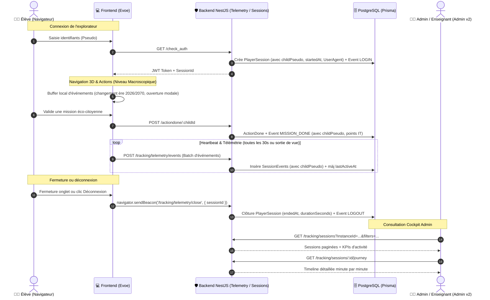

# 🛰️ Plan d'Implémentation : Statistiques & Suivi — Traçabilité des Joueurs (Sessions, Connexions & Parcours)

> **Statut :** Plan Clarifié avec Cartographie des Onglets  
> **Date de mise à jour :** 13 Septembre 2026  
> **Cible :** `apps/backend-v2`, `apps/admin-sosplanete-v2`, `apps/evoe-frontend`

---

## 🗺️ 1. Cartographie Claire des Écrans & des Onglets

Pour répondre directement à votre question de repérage, voici la répartition exacte et simplifiée :

```
ADMINISTRATION SOS PLANÈTE
│
├── 1. Tableau de bord (/dashboard) — Vue Globale Multi-Établissements
│    ├── Onglet 1 : Espaces (Grille des établissements avec KPI)
│    └── Onglet 2 : Impact Global (Course EcoBarRace inter-écoles) [Option de maintien ou déplacement]
│
├── 2. Mon Établissement (/dashboard/organization) — 100% CONFIGURATION
│    ├── Général (Infos école, année, logo)
│    ├── Périodes de jeu (Dates, calendrier, clôtures)
│    ├── Équipes & Groupes (Classes, élèves, codes d'accès)
│    ├── Catalogue d'actions (Sélection des actions, barèmes)
│    ├── Catégories (Piliers écologiques)
│    └── WhatsApp (Liens et QR codes de groupes)
│
└── 3. NOUVEAU : Statistiques & Suivi (/dashboard/tracking) — 100% ANALYSE DE L'ÉTABLISSEMENT
     │
     ├── 📈 Onglet 1 : Impact 
     │    └── [Récupéré de TrackingView] : Bilan CO2, Eau, Déchets, thermomètre planétaire, aide aux calculs
     │
     ├── 📊 Onglet 2 : Suivi actions 
     │    └── [Récupéré de TrackingView] : Matrice élèves x semaines, KPI de participation, import & export CSV
     │
     ├── 🐾 Onglet 3 : Déblocage Animaux 
     │    └── [Récupéré de TrackingView] : Progression des animaux libérés par période, bouton recalcul
     │
     └── 🛰️ Onglet 4 : Traçabilité Joueurs (NOUVEAU)
          └── Sessions, connexions, durée de présence, support mobile/PC, parcours QG 2026/2070, timeline interactive
```

---

### 💡 Arbitrage sur l'onglet "Impact Global" (Course EcoBarRace) du Dashboard :

* **Actuellement sur `/dashboard`** : Il affiche la **course EcoBarRace entre TOUS les établissements** (comparatif global pour l'administrateur général AS).
* **Deux options possibles :**
  - **Option 1 (Séparation naturelle Macro vs Micro — Recommandée)** :
    - On laisse l'EcoBarRace globale sur la page d'accueil `/dashboard` (car elle compare tous les établissements entre eux).
    - Et la nouvelle page `/dashboard/tracking` est dédiée aux **4 onglets de l'établissement actif** : `Impact`, `Suivi actions`, `Déblocage Animaux`, `Traçabilité Joueurs`.
  - **Option 2 (Regroupement Total dans Statistiques & Suivi)** :
    - On supprime les onglets de la page d'accueil `/dashboard` (qui ne montre plus que la grille des Espaces).
    - On déplace l'EcoBarRace dans la nouvelle page `/dashboard/tracking` (en tant qu'onglet supplémentaire ou intégrée dans l'onglet Impact).

---

## 🏗️ 2. Architecture Globale du Flux de Traçabilité



---

## 🗄️ 3. Modélisation Base de Données (Prisma Schema)

> [!IMPORTANT]
> **Règle clé :** Chaque trace enregistre explicitement le **`childPseudo`** en dur, assurant une lecture directe, des requêtes ultra-rapides sans jointures obligatoires et un historique immuable même en cas de modification de compte.

```prisma
// 1. Session globale d'un joueur
model PlayerSession {
  id              String         @id @default(uuid())
  childId         Int
  childPseudo     String         // ✅ Pseudo de l'élève présent sur chaque trace
  instanceYearId  Int?
  instanceId      Int
  schoolYear      String
  startedAt       DateTime       @default(now())
  lastActiveAt    DateTime       @default(now())
  endedAt         DateTime?
  durationSeconds Int            @default(0)
  
  // Contexte technique
  deviceType      String?        // "MOBILE_PORTRAIT", "MOBILE_LANDSCAPE", "DESKTOP"
  browser         String?        // "Chrome", "Safari", "Firefox", etc.
  os              String?        // "Android", "iOS", "Windows", "MacOS"
  
  // Statut
  status          SessionStatus  @default(ACTIVE) // ACTIVE, CLOSED, EXPIRED

  // Relations
  child           Child          @relation(fields: [childId], references: [id], onDelete: Cascade)
  events          SessionEvent[]

  @@index([instanceId, schoolYear])
  @@index([childId, startedAt])
  @@index([childPseudo])
  @@index([startedAt])
  @@map("evoe_player_session")
}

enum SessionStatus {
  ACTIVE
  CLOSED
  EXPIRED
}

// 2. Événement unitaire de parcours (Niveau Macroscopique)
model SessionEvent {
  id                Int             @id @default(autoincrement())
  sessionId         String
  childId           Int
  childPseudo       String          // ✅ Pseudo de l'élève présent sur chaque trace
  timestamp         DateTime        @default(now())
  
  eventType         EventType
  target            String          // "QG_2026", "WORLD_2070", "CODEX_MISSIONS", "AGENT_PROFILE", "CHAT", "ACTION_VALIDATED"
  label             String?         // "Passerelle Orbitale", "Mission: Éteindre les veilles"
  timeSpentSeconds  Int             @default(0)
  metadata          Json?           // { actionId, pointsIT, missionTitle, sector, etc. }

  session           PlayerSession   @relation(fields: [sessionId], references: [id], onDelete: Cascade)

  @@index([sessionId, timestamp])
  @@index([childId, timestamp])
  @@index([childPseudo])
  @@index([eventType])
  @@map("evoe_session_event")
}

enum EventType {
  LOGIN
  LOGOUT
  PAGE_VIEW
  MISSION_DONE
  MISSION_CANCELLED
  CHALLENGE_INTERACTION
  EASTER_EGG_INTERACTION
  HEARTBEAT
}
```

---

## ⚙️ 4. Backend NestJS (`apps/backend-v2`)

### 4.1. Module Télémétrie (`TrackingModule`)
- **Création automatique de session** : Déclenchée lors du `check_auth` avec détection automatique du support (User-Agent : Mobile Portrait/Paysage ou Desktop) et enregistrement du `childPseudo`.
- **Collecteur par lot (`POST /tracking/telemetry/events`)** : Reçoit les événements groupés et met à jour `lastActiveAt`.
- **Balise de sortie (`POST /tracking/telemetry/close`)** : Fermeture propre de session via `navigator.sendBeacon`.
- **Tâche Cron de nettoyage** : Clôture automatique des sessions inactives (> 15 min sans signal) en calculant leur durée finale.
- **Endpoints Admin sécurisés (JWT AM/AS)** :
  - `GET /tracking/sessions` : Liste paginée avec filtres (instance, année, équipe, classe, pseudo, dates).
  - `GET /tracking/sessions/:id/journey` : Chronologie complète d'une session.
  - `GET /tracking/sessions/kpis` : Total connexions, temps moyen, élèves actifs.
  - `POST /tracking/sessions/purge` : **Suppression explicite** des sessions et événements sur demande de l'AM ou de l'AS.

---

## 📱 5. Collecteur Frontend Silencieux (`apps/evoe-frontend`)

### 5.1. Granularité Macroscopique & Zéro Impact Performance
Le collecteur est un singleton ultra-léger qui ne suit que les **transitions macroscopiques** :
1. **Changement d'ère** : Passage en Passerelle 2026 ou Voyage 2070 (avec calcul du temps resté dans chaque ère).
2. **Ouverture de modales majeures** : Codex des missions, Profil d'Agent, Comm-Link (Chat), Leaderboard, Défis, Journal de bord.
3. **Actions majeures** : Impulsion d'une mission, annulation, interaction Easter Egg.
4. **Buffer local & Envoi toutes les 30s** : Aucun appel réseau lors des animations ou manipulations 3D.
5. **Déconnexion propre** : Envoi de l'événement `LOGOUT` au clic sur "Déconnexion" ou à la fermeture de page (`sendBeacon`).

---

## 🖥️ 6. Détail de la Page Admin "Statistiques & Suivi" (`apps/admin-sosplanete-v2`)

### 6.1. Navigation dans la Sidebar
- **Nouvelle entrée principale** :
  - Icône : `BarChart3`
  - Libellé : **"Statistiques & Suivi"**
  - URL : `/dashboard/tracking?instanceId=...`
- **Nettoyage de "Mon Établissement"** : suppression de l'onglet `tracking` pour ne garder que la configuration pure.

### 6.2. Les 4 Onglets de premier niveau :
1. **Onglet 1 : Impact** *(existant `IndicatorsTab`)* :
   - Émissions de CO2 évitées, eau préservée, déchets détournés.
   - Constantes d'établissement, thermomètre de la Terre, modale d'aide aux calculs.
2. **Onglet 2 : Suivi actions** *(existant `TrackingMatrix`)* :
   - Tableau matriciel croisé élèves x semaines.
   - Totaux hebdomadaires et cumulés.
   - Import et export CSV des actions.
3. **Onglet 3 : Déblocage Animaux** *(existant)* :
   - Progression des animaux débloqués par période.
   - Bouton de recalcul de l'avancement animal.
4. **Onglet 4 : Traçabilité Joueurs (NOUVEAU)** :
   - **Bandeau d'alerte bienveillant & Purge manuelle** :
     > *Rappel AM : "Les données de traçabilité sont conservées depuis X jours. Pensez à les purger en fin d'année si vous n'en avez plus l'utilité pédagogique."* + Bouton **"Purger l'historique"** avec modale de confirmation stricte.
   - **Barre de KPIs** : Connexions actives en direct (pulse vert), Total connexions sur la période, Durée moyenne par session, Taux d'élèves connectés.
   - **Filtres de recherche** : Équipe, Classe (Groupe), Recherche textuelle par **Pseudo**.
   - **Tableau des Sessions** : Horodatage, Élève (Avatar + Pseudo + Équipe), Support (Mobile / Ordinateur), Durée, Résumé d'activité, Statut (En direct / Terminé), Bouton "Voir le parcours".
   - **Tiroir Latéral (Slide-over) "Timeline Interactive du Parcours"** : Panneau latéral déroulant la session minute par minute.
   - **Export CSV** : Feuille de présence et d'activité pour l'enseignant.

---

## 🔒 7. Conformité RGPD & Pseudonymat Garanti

> [!NOTE]
> **Pseudonymat strict :**
> - À aucun moment la plateforme n'établit de correspondance entre le pseudonyme et l'identité civile de l'élève (aucun nom, prénom, email, téléphone ou adresse n'est collecté ni stocké pour les élèves).
> - Seul l'enseignant dans sa classe connaît l'attribution des pseudonymes.
> 
> **Rétention & Purge sous contrôle humain :**
> - **Aucune suppression automatique aveugle**. Les traces restent disponibles tant que l'AM ou l'AS ne demande pas leur suppression.
> - **Système d'alertes & rappels** : Au bout de **90 jours** sans purge, ainsi qu'à la **clôture de l'année scolaire**, une notification discrète informe l'AM : *"Pensez à purger les logs de connexion si vous n'en avez plus l'utilité pédagogique"*.
> - Le bouton de purge permet à l'enseignant de supprimer les logs techniques détaillés en conservant intactes les actions écologiques cumulées (`ActionDone`).

---

## 📋 8. Découpage des Tâches d'Implémentation

### Phase 1 : Base de Données & Migration Prisma
- [ ] Ajout des modèles `PlayerSession` et `SessionEvent` avec champ `childPseudo` dans `schema.prisma`.
- [ ] Exécution de la migration PostgreSQL (`npx prisma migrate dev`).
- [ ] Indexation par `childPseudo`, `startedAt`, `instanceId` et `schoolYear`.

### Phase 2 : Backend NestJS
- [ ] Implémentation du service de télémétrie (`session.start`, `events.batch`, `session.close`).
- [ ] Hook dans `check_auth` / `loginChild` pour enregistrer la session dès la connexion.
- [ ] Tâche Cron de clôture des sessions inactives (> 15 min).
- [ ] Endpoints Admin avec filtres (`GET /tracking/sessions`, `GET /tracking/sessions/:id/journey`, `GET /tracking/sessions/kpis`).
- [ ] Endpoint de purge manuelle sécurisé (`POST /tracking/sessions/purge`).

### Phase 3 : Collecteur Frontend Joueur (`evoe-frontend`)
- [ ] Création du module `telemetryService.ts`.
- [ ] Détection macroscopique : Changement d'ère (2026 / 2070), ouverture/fermeture des modales (Codex, Profil, Leaderboard, Comm-Link, About).
- [ ] Traçage des impulsions et annulations de missions.
- [ ] Buffer local et envoi périodique par lot (toutes les 30s).
- [ ] Balise de sortie `navigator.sendBeacon` sur `beforeunload`.

### Phase 4 : Interface Admin "Statistiques & Suivi" (`admin-sosplanete-v2`)
- [ ] Création de la page route `/dashboard/tracking/page.tsx` avec les 4 onglets :
  - Onglet 1 : Impact (existant `IndicatorsTab`)
  - Onglet 2 : Suivi actions (existant `TrackingMatrix`)
  - Onglet 3 : Déblocage Animaux (existant)
  - Onglet 4 : Traçabilité Joueurs (Nouveau)
- [ ] Nettoyage de `OrganizationPage` (retrait de l'onglet tracking devenu redondant).
- [ ] Ajout du lien "Statistiques & Suivi" dans la sidebar `DashboardLayout.tsx`.
- [ ] Création des composants de l'onglet Traçabilité :
  - Barre de KPIs et bandeau de rappel (90 jours / fin d'année)
  - Barre de filtres et recherche par pseudo
  - Tableau des sessions avec badges de support
  - Tiroir latéral (Slide-over) de Timeline interactive
  - Modale de purge manuelle
  - Export CSV des présences
