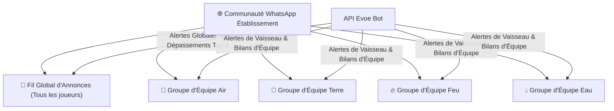

# 📱 Plan d'Implémentation : Communauté & Notifications WhatsApp (Evoe)

Ce document détaille la proposition technique et fonctionnelle pour intégrer une **Communauté WhatsApp** au cœur du système de jeu EVOE afin de booster l'engagement, la réactivité et la dynamique de groupe avant l'implémentation de l'Axe 4 (Système de Preuves).

---

> [!NOTE]
> **Objectif** : Structurer l'établissement sous forme de **Communauté WhatsApp officielle** (Canal d'Annonces Global + Groupes d'Équipes rattachés) qui agit comme un **"Canal de Transmission Temporel"** actif. Il informe les joueurs en temps réel des rebondissements du jeu et réengage en 1 clic dans l'application.

---

## 🌐 1. Architecture "Communauté WhatsApp" (Global + Équipes)

> [!IMPORTANT]
> **Oui, la création d'une Communauté WhatsApp est la structure idéale !** WhatsApp propose nativement le concept de **Communautés**, permettant d'unifier le fil global et les fils d'équipes au même endroit.



### 💡 Avantages Majeurs du Mode Communauté :
1. **Lien d'Invitation Unique (1-Click Onboarding)** :
   * L'Admin fournit un **seul lien d'invitation à la Communauté**. En le rejoignant, l'élève a immédiatement accès au fil d'Annonces Global et à son groupe d'équipe.
2. **Confidentialité & Protection des Élevés** :
   * Dans le **Fil d'Annonces Global**, les numéros de téléphone et la liste des membres sont **masqués** entre les participants (conformité RGPD / Cadre Scolaire).
3. **Séparation des Usages** :
   * **Fil Global (Annonces & Bot)** : Réservé aux annonces officielles du jeu (classement général, duels inter-équipes, événements globaux). Seul le Bot / l'Admin écrit.
   * **Fils d'Équipes (Discussion & Stratégie)** : Espaces d'échanges ouverts entre équipiers pour organiser leurs impulsions et relever les défis.

---

## 🎯 2. Les 4 Piliers Fonctionnels

### 📢 Pilier 1 : Alertes de Jeu en Temps Réel (Fils Ciblés)
* **Sur le Fil Global (Annonces)** :
  * 🏆 **Dépassement du Top 3** : *"Alerte Générale ! @Romain vient de ravir la 1ère place du classement global à @William !"*
  * ⚔️ **Lancement de Duel** : *"Duel déclaré ! L'Équipe Air affronte l'Équipe Terre. Fin du chrono dans 48h !"*
* **Sur les Fils d'Équipes** :
  * ⚠️ **Alerte Paradoxe Temporel** : *"Instabilité du Vaisseau ! La santé de l'équipe chute sous 50%. Impulsions requises !"*
  * 🌱 **Impulsion Réussie** : *"L'Agent @Mariane vient de faire gagner 150 L d'eau à l'équipe !"*

---

### 📊 Pilier 2 : Le Bulletin Hebdomadaire Automatisé (Bilan d'Équipe & Global)
Tous les vendredis à 17h :
* **Sur le Fil d'Équipe** : Synthèse complète d'équipe (CO2 évité, litres d'eau, classement des 3 meilleurs agents de la semaine, niveau du moteur).
* **Sur le Fil Global** : Classement général des équipes et félicitations au Vaisseau leader.

---

### 🔗 Pilier 3 : Liens d'Action Rapide / Deep Links (1-Click Re-Engagement)
Chaque message WhatsApp comporte des liens profonds vers l'application EVOE :
* `[ 🚀 Rejoindre le QG 2026 ]` $\rightarrow$ Ouvre directement le portail EVOE.
* `[ ⚔️ Relever le Défi ]` $\rightarrow$ Ouvre l'application directement sur la modale du défi concerné.
* `[ 🏆 Voir le Podium 3D ]` $\rightarrow$ Ouvre EVOE directement en vue Classement 3D.

---

### ⚙️ Pilier 4 : Configuration Simplifiée dans l'Admin SOS Planète
Dans l'interface d'administration (`admin-sosplanete-v2`), onglet **Mon Établissement** $\rightarrow$ **Canaux Temporels (Communauté WhatsApp)** :
* **Lien de la Communauté** : `whatsappCommunityInviteUrl`
* **Identifiant du Fil d'Annonces Global** : `whatsappGeneralGroupId`
* **Identifiants des Sous-Groupes d'Équipes** :
  * Pour chaque équipe : `whatsappGroupId` et `whatsappInviteUrl`.
  * Bouton **"Tester le canal"** pour vérifier la livraison des messages d'essai.

---

## 🛠️ 3. Architecture Technique & Backend

### Extension du Schéma Prisma (`schema.prisma`)
```prisma
model Instance {
  id                        Int     @id @default(autoincrement())
  // ... champs existants ...
  whatsappCommunityUrl      String? // Lien d'invitation à la Communauté
  whatsappGeneralGroupId    String? // ID du canal d'Annonces Global
}

model Team {
  id                        Int     @id @default(autoincrement())
  name                      String
  color                     String?
  // ... champs existants ...
  whatsappInviteUrl         String? // Lien d'invitation au groupe d'équipe
  whatsappGroupId           String? // ID du sous-groupe d'équipe
}
```

### Service Backend NestJS (`WhatsAppService`)
* Module `WhatsAppModule` connecté à l'API WhatsApp (ex: **Evolution API** auto-hébergée, **Twilio WhatsApp API** ou **GreenAPI**).
* Routage intelligent des messages :
  * Messages généraux $\rightarrow$ `whatsappGeneralGroupId` (Fil d'Annonces).
  * Messages d'équipe $\rightarrow$ `whatsappGroupId` de l'équipe concernée.

---

## 📋 4. Découpage par Étapes d'Implémentation

### 🔹 Étape 1 : Modèle de Données & Administration (Backend + Admin)
1. Mise à jour du schéma Prisma avec les champs de Communauté et Sous-groupes.
2. Interface de configuration de la Communauté WhatsApp dans l'Admin (`apps/admin-sosplanete-v2`).
3. Bouton de test d'envoi.

### 🔹 Étape 2 : Connecteur WhatsApp Backend & Templates
1. Implémentation du service NestJS `WhatsAppService`.
2. Templates de messages formatés (Annonces Globales vs Notifications d'Équipes).

### 🔹 Étape 3 : Déclencheurs Temps Réel & Deep Links
1. Envoi automatisé lors d'une impulsion, d'un duel ou d'un changement de #1 sur le podium.
2. Intégration des liens profonds 1-click dans WhatsApp.

### 🔹 Étape 4 : Tâche Planifiée du Bilan Hebdo (Cron Job)
1. Génération automatique du bilan chaque vendredi à 17h sur le fil d'équipe et le fil global.

---

## ✍️ Vos Annotations & Remarques (Valider ou modifier)

> [!TIP]
> *Utilisez cette section pour confirmer la structure en Communauté ou apporter vos précisions.*

* **Structure en Communauté WhatsApp** : Validé ✅
* **Choix du fournisseur API WhatsApp** : *(ex: Evolution API, Twilio, GreenAPI)*
* **Remarques / Demandes spécifiques** : 

---
