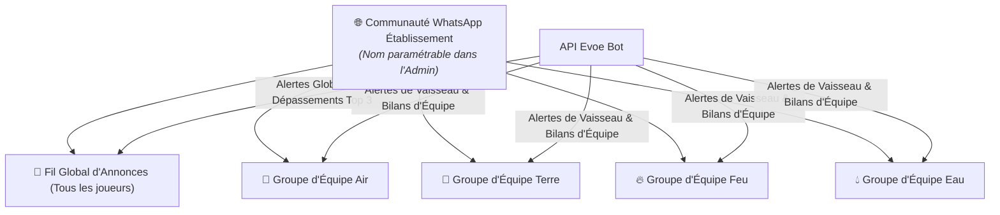
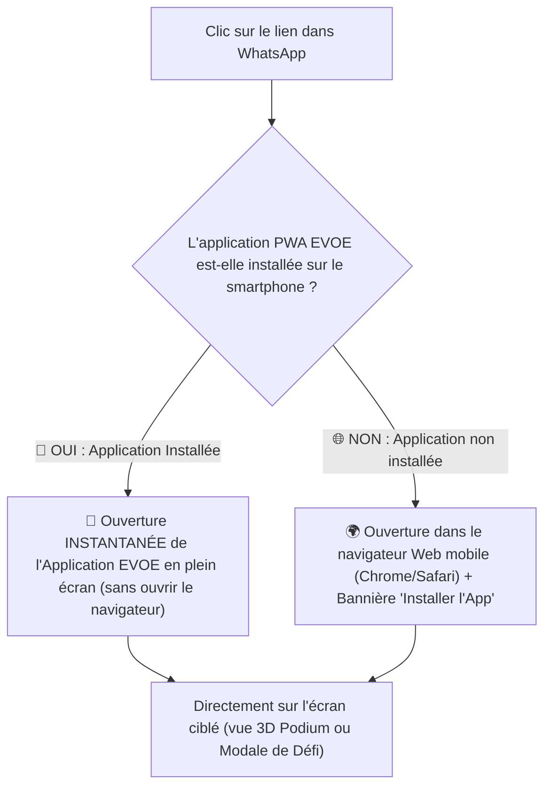

# 📱 Plan d'Implémentation : Communauté & Notifications WhatsApp (Evoe)

Ce document détaille la proposition technique et fonctionnelle pour intégrer une **Communauté WhatsApp** au cœur du système de jeu EVOE afin de booster l'engagement, la réactivité et la dynamique de groupe avant l'implémentation de l'Axe 4 (Système de Preuves).

---

> [!NOTE]
> **Objectif** : Structurer l'établissement sous forme de **Communauté WhatsApp officielle** (Canal d'Annonces Global + Groupes d'Équipes rattachés) qui agit comme un **"Canal de Transmission Temporel"** actif. Il informe les joueurs en temps réel des rebondissements du jeu et réengage en 1 clic dans l'application.

---

## 🌐 1. Architecture "Communauté WhatsApp" (Global + Équipes)

> [!IMPORTANT]
> **Nom & Structure de la Communauté** : Le nom officiel de la communauté WhatsApp (ex: *"Communauté SOS Planète - Collège Saint-Exupéry"*) est **intégralement paramétrable** dans l'interface d'administration EVOE.



### 🔒 Exemple Concret de Confidentialité (Groupe Classique vs Canal de Communauté)

> [!TIP]
> **Pourquoi le mode "Communauté WhatsApp" résout le problème du RGPD et du Cadre Scolaire ?**

#### ❌ Scénario dans un Groupe WhatsApp Classique (Sans Communauté) :
* L'élève **Léo (14 ans, Équipe Air)** rejoint un groupe WhatsApp classique avec les 200 élèves de l'école.
* En cliquant sur les détails du groupe, Léo a accès à la **liste complète des 200 numéros de téléphone personnels** de tous les autres élèves (même ceux qu'il ne connaît pas des autres classes, ex: `06 12 34 56 78`).
* **Risque** : Non-conformité RGPD, fuite de numéros de téléphone et sollicitations non désirées entre élèves.

#### ✅ Scénario dans le Canal d'Annonces de la Communauté WhatsApp (Evoe) :
* Léo rejoint la **Communauté WhatsApp officielle** du collège.
* Il accède au **Fil Global d'Annonces (📢)**.
* S'il clique sur les détails du Fil d'Annonces, WhatsApp affiche uniquement : *"200 membres"*. **Aucun numéro de téléphone n'est visible**, sauf le sien et celui des Administrateurs/Bot EVOE.
* **Sécurité & Dynamique** : Les numéros sont 100% masqués entre élèves, le Bot diffuse les alertes globales de jeu (dépassements de podium, duels), et seuls les admins/bots peuvent poster.

---

### 💡 Avantages Majeurs du Mode Communauté :
1. **Lien d'Invitation & Nom Unique (1-Click Onboarding)** :
   * L'Admin définit le **Nom de la Communauté** et fournit le **lien d'invitation à la Communauté**. En le rejoignant, l'élève a immédiatement accès au fil d'Annonces Global et à son groupe d'équipe.
2. **Masquage Automatique des Numéros** :
   * Dans le **Fil d'Annonces Global**, la liste des participants et leurs numéros sont rendus invisibles par WhatsApp (conformité Éducation Nationale / RGPD).
3. **Séparation des Usages** :
   * **Fil Global (Annonces & Bot)** : Réservé aux annonces officielles du jeu (classement général, duels inter-équipes, événements globaux). Seul le Bot / l'Admin écrit.
   * **Fils d'Équipes (Discussion & Stratégie)** : Espaces d'échanges restreints entre membres de la même équipe pour organiser leurs impulsions et relever les défis.

---

## 🎯 2. Les 4 Piliers Fonctionnels

### 📢 Pilier 1 : Alertes de Jeu en Temps Réel (Fils Ciblés)
* **Sur le Fil Global (Annonces)** :
  * 🏆 **Dépassement du Top 3** : *"Alerte Générale ! @Romain vient de ravir la 1ère place du classement global à @William !"*
  * ⚔️ **Lancement de Duel** : *"Duel déclaré ! L'Équipe Air affronte l'Équipe Terre. Fin du chrono dans 48h !"*
* **Sur les Fils d'Équipes** :
  * ⚠️ **Alerte Paradoxe Temporel** : *"Instabilité du Vaisseau ! La santé de l'équipe chute sous 50%. Impulsions requises !"*
  * 🌱 **Impulsion Réussie** : *"L'Agent @Mariane vient de faire gagner 150 L d'eau à l'équipe !"*

---

### 📊 Pilier 2 : Le Bulletin Hebdomadaire Automatisé (Bilan d'Équipe & Global)
Tous les vendredis à 17h :
* **Sur le Fil d'Équipe** : Synthèse complète d'équipe (CO2 évité, litres d'eau, classement des 3 meilleurs agents de la semaine, niveau du moteur).
* **Sur le Fil Global** : Classement général des équipes et félicitations au Vaisseau leader.

---

### 🔗 Pilier 3 : Liens d'Action Rapide & Universal Links (Application PWA & Web)

> [!IMPORTANT]
> **Que se passe-t-il lors d'un clic sur un lien WhatsApp si l'application EVOE est installée sur le téléphone ?**



* **📲 Si l'application EVOE est installée sur le smartphone (PWA)** :
  * Le système d'exploitation (Android ou iOS) intercepte le lien via le mécanisme des **Universal Links / App Links PWA**.
  * **L'application EVOE installée s'ouvre directement en plein écran** (sans la barre d'adresse du navigateur Web).
  * L'application bascule automatiquement sur l'écran visé (ex: activation directe de la caméra 3D sur le Podium ou ouverture immédiate de la fiche de Défi).

* **🌐 Si l'application N'EST PAS installée sur le smartphone** :
  * Le lien s'ouvre naturellement dans le navigateur mobile par défaut (Chrome, Safari, Brave) et charge le portail EVOE.
  * Une bannière discrète propose à l'élève d'ajouter EVOE à son écran d'accueil en 1 clic.

---

### ⚙️ Pilier 4 : Configuration Simplifiée dans l'Admin SOS Planète
Dans l'interface d'administration (`admin-sosplanete-v2`), onglet **Mon Établissement** $\rightarrow$ **Canaux Temporels (Communauté WhatsApp)** :
* **Paramètres de la Communauté Établissement** :
  * `whatsappCommunityName` : **Nom de la Communauté WhatsApp** (ex: *"Communauté SOS Planète - Lycée Saint-Exupéry"*).
  * `whatsappCommunityInviteUrl` : Lien d'invitation parent à la Communauté.
  * `whatsappGeneralGroupId` : Identifiant du Fil d'Annonces Global.
* **Identifiants des Sous-Groupes d'Équipes** :
  * Pour chaque équipe : `whatsappGroupId` et `whatsappInviteUrl`.
  * Bouton **"Tester le canal"** pour vérifier la livraison des messages d'essai.

---

## 🧪 3. Procédure & Modes de Test (Comment tester la fonctionnalité ?)

Vous pourrez tester la fonctionnalité selon **3 modes progressifs et très simples** :

### 🖥️ Mode 1 : Le Simulateur Virtuel (Sans aucun compte WhatsApp)
* Dans l'interface d'administration, à côté de chaque canal, un bouton **"Aperçu & Test Virtuel"** permet de simuler les notifications.
* Une fenêtre contextuelle ("Modal de Prévisualisation WhatsApp") s'affiche en reproduisant **à l'identique l'écran d'un smartphone avec la bulle de message WhatsApp**, ses emojis et ses boutons.
* Cela permet de vérifier la mise en page et le texte des notifications sans avoir besoin de compte WhatsApp ni de téléphone sous la main.

### 📱 Mode 2 : Test Réel sur votre Téléphone (Groupe de Test WhatsApp)
1. **Création d'un Groupe / Communauté de Test** sur votre propre téléphone (ex: *"Test EVOE"*).
2. **Connexion API Rapide & Gratuite** (Twilio Sandbox ou QR Code Evolution API) :
   * Vous flashez un QR Code dans l'Admin (ou utilisez la Sandbox gratuite Twilio).
   * Vous collez l'ID de votre groupe de test dans l'Admin.
3. **Déclenchement du Test** :
   * En cliquant sur le bouton **"Tester le canal"** dans l'Admin ou en réalisant une action de jeu de test sur EVOE (ex: simuler une impulsion ou un dépassement de classement), le message est **instantanément envoyé et reçu dans votre vrai groupe WhatsApp** sur votre smartphone !

### 🔗 Mode 3 : Test des Liens d'Action Rapide (1-Click Deep Links / App PWA)
* Sur votre smartphone, vous ouvrez le message reçu dans votre application WhatsApp.
* Vous appuyez sur le lien `[ 🏆 Voir le Podium 3D ]` ou `[ ⚔️ Relever le Défi ]`.
* **Résultat attendu** : 
  * Si EVOE est installée comme application PWA, l'application **s'ouvre en plein écran** directement sur l'écran 3D ou le défi ciblé.
  * Sinon, le navigateur s'ouvre et charge la page avec l'écran ciblé.

---

## 🛠️ 4. Architecture Technique & Backend

### Extension du Schéma Prisma (`schema.prisma`)
```prisma
model Instance {
  id                        Int     @id @default(autoincrement())
  // ... champs existants ...
  whatsappCommunityName     String? // Nom officiel de la Communauté WhatsApp
  whatsappCommunityUrl      String? // Lien d'invitation à la Communauté
  whatsappGeneralGroupId    String? // ID du canal d'Annonces Global
}

model Team {
  id                        Int     @id @default(autoincrement())
  name                      String
  color                     String?
  // ... champs existants ...
  whatsappInviteUrl         String? // Lien d'invitation au groupe d'équipe
  whatsappGroupId           String? // ID du sous-groupe d'équipe
}
```

### Service Backend NestJS (`WhatsAppService`)
* Module `WhatsAppModule` connecté à l'API WhatsApp (ex: **Evolution API** auto-hébergée, **Twilio WhatsApp API** ou **GreenAPI**).
* Utilisation du champ `whatsappCommunityName` dans l'en-tête et la signature officielle des messages du Bot.
* Routage intelligent des messages :
  * Messages généraux $\rightarrow$ `whatsappGeneralGroupId` (Fil d'Annonces).
  * Messages d'équipe $\rightarrow$ `whatsappGroupId` de l'équipe concernée.

---

## 📋 5. Découpage par Étapes d'Implémentation

### 🔹 Étape 1 : Modèle de Données & Administration + Simulateur (Backend + Admin)
1. Mise à jour du schéma Prisma avec les champs `whatsappCommunityName`, `whatsappCommunityUrl` et sous-groupes.
2. Interface de configuration avec champ **Nom de la Communauté** et des sous-canaux dans l'Admin (`apps/admin-sosplanete-v2`).
3. Bouton **"Aperçu & Test Virtuel"** (Simulateur d'écran smartphone).

### 🔹 Étape 2 : Connecteur WhatsApp Backend & Templates
1. Implémentation du service NestJS `WhatsAppService`.
2. Templates de messages formatés (incluant le nom personnalisé de la communauté).

### 🔹 Étape 3 : Déclencheurs Temps Réel & Deep Links (PWA Universal Links)
1. Envoi automatisé lors d'une impulsion, d'un duel ou d'un changement de #1 sur le podium.
2. Configuration du routage PWA (Universal App Links) pour l'ouverture directe de l'app installée.

### 🔹 Étape 4 : Tâche Planifiée du Bilan Hebdo (Cron Job)
1. Génération automatique du bilan chaque vendredi à 17h sur le fil d'équipe et le fil global.

---

## ✍️ Vos Annotations & Remarques (Valider ou modifier)

> [!TIP]
> *Utilisez cette section pour confirmer le comportement de l'application installée ou apporter vos précisions.*

* **Comportement si Application installée (PWA Universal Links)** : Ajouté au plan ✅
* **Procédure de Test (Simulateur Admin + Groupe Réel)** : Ajouté au plan ✅
* **Exemple de confidentialité des numéros** : Ajouté au plan ✅
* **Paramétrage du Nom de la Communauté** : Prévu dans l'Admin (`whatsappCommunityName`) ✅
* **Structure en Communauté WhatsApp** : Validé ✅
* **Remarques / Demandes spécifiques** : 

---
