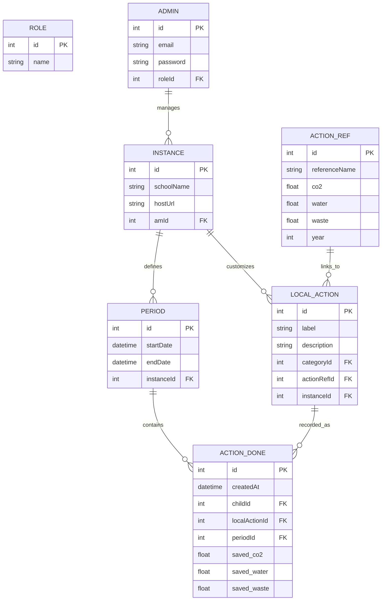

# 🏗️ Architecture Technique - sos-planete (v2 Avancée)

Ce document décrit la stack technique et l'organisation multi-instances.

## 🚀 Stack Technologique
- **Backend** : NestJS / Prisma / PostgreSQL (Inspiré de Wagmoo).
- **Frontend** : Next.js 15 (Premium Design).

## 📊 Modèle de Données (v2)

## 🔐 Sécurité & Multi-Instance
- **Isolation** : Chaque AM ne voit que les données de son `INSTANCE_ID`.
- **Mots de passe** : Hachage bcrypt/Argon2 (Standard Wagmoo).
- **Authentification** : JWT avec payload incluant le `role` et le `instanceId`.

## ⚓ Couche de Compatibilité (Legacy Game)
Pour assurer le fonctionnement du jeu vidéo sans modification :
- **Reverse Routing** : Les anciennes routes API (ex: `/api/v1/...`) seront redirigées ou implémentées en miroir dans le nouveau backend.
- **Data Mapping** : Les objets retournés par le nouveau backend respecteront scrupuleusement le format JSON attendu par le jeu original.
