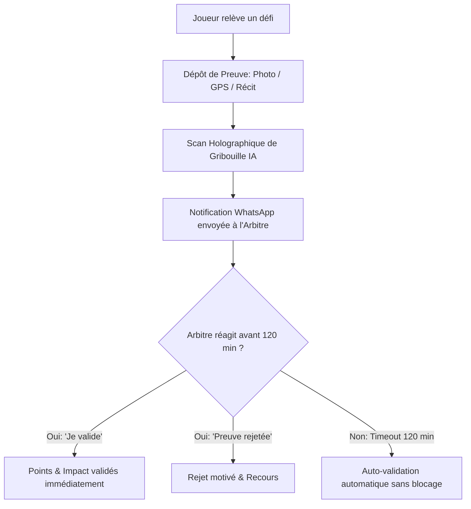

# 🛡️ EPIC-11 : Système de Preuves & Validation des Défis (Anti-Triche & Social)

> **Source de Conception :** Axe 4 des *Propositions Design Gameplay*  
> **Statut :** Spécifié / À Développer  
> **Priorité Globale :** Must Have  
> **Complexité Totale :** 26 Story Points (Fibonacci)

---

## 🎯 Vision & Objectifs Métier

Pour rendre les défis crédibles, motivants et éviter la triche (ex: déclarer 10 km de vélo sans les avoir faits), cet Epic introduit un système hybride combinant **preuves multimodales**, **validation sociale par arbitres pairs**, **auto-validation par timeout** et **immersion ludique via la mascotte IA Gribouille**.



---

## 📋 Découpage des User Stories

| ID Story | Titre & Rôle | Complexité | Valeur Métier | Priorité | Statut |
| :--- | :--- | :---: | :---: | :---: | :---: |
| **US 11.1** | Dépôt de Preuve Multimodale (Photo, GPS, Récit) | 8 | 13 | Must (M) | `[ ]` todo |
| **US 11.2** | Rôle d'Arbitre d'Équipe & Interface de Modération | 8 | 21 | Must (M) | `[ ]` todo |
| **US 11.3** | Notifications WhatsApp & Auto-Validation au Timeout (120 min) | 5 | 13 | Should (S) | `[ ]` todo |
| **US 11.4** | Mascotte Gribouille & Scan Holographique Humoristique | 5 | 8 | Could (C) | `[ ]` todo |

---

## 📜 Spécifications Détaillées des Stories

### 🔹 US 11.1 : Dépôt de Preuve Multimodale (Photo, GPS, Récit)
* **En tant qu'** Agent Temporel ayant relevé un défi nécessitant une preuve,
* **Je veux** soumettre une preuve sous forme de photo directe, capture/lien de tracé GPS ou récit écrit,
* **Afin de** justifier la réalisation effective de mon éco-action et soumettre mes points à validation.

#### ⚙️ Critères d'Acceptation (Gherkin) :
```gherkin
Scénario: Soumission d'une preuve visuelle (Photo)
  Étant donné qu'un agent temporel valide un défi exigeant une preuve visuelle
  Quand il clique sur "Fournir une preuve"
  Alors l'application lui propose de prendre une photo via l'appareil ou d'uploader un fichier (< 5 Mo)
  Et une prévisualisation de l'image est affichée avec possibilité de recadrer avant validation.

Scénario: Soumission d'un tracé GPS (Déplacement / Mobilité douce)
  Étant donné qu'un agent temporel valide un défi de type "10 km à vélo"
  Quand il choisit le type de preuve "Tracé GPS"
  Alors il peut uploader une capture d'écran d'application tierce (Strava, Komoot, Santé iOS/Android) ou coller une URL publique valide.

Scénario: Soumission d'un récit descriptif obligatoire
  Étant donné qu'un agent temporel soumet une preuve
  Quand il valide le formulaire
  Alors un champ texte "Raconte ton action" (minimum 10 caractères) est exigé pour contextualiser l'effort.
```

---

### 🔹 US 11.2 : Rôle d'Arbitre d'Équipe & Interface de Modération
* **En tant qu'** Arbitre désigné au sein de mon équipe,
* **Je veux** accéder à un panneau de modération listant les preuves en attente et statuer via "Je valide" ou "Preuve rejetée",
* **Afin de** maintenir l'équité sportive, encourager mes pairs et crédibiliser nos victoires.

#### ⚙️ Critères d'Acceptation (Gherkin) :
```gherkin
Scénario: Consultation de la file d'attente d'arbitrage
  Étant donné qu'un utilisateur possède le rôle "Arbitre" pour son équipe
  Quand il ouvre le panneau "Arbitrage & Preuves"
  Alors il visualise toutes les preuves soumises par les membres de sa classe avec photo, lien GPS, récit et heure de soumission.

Scénario: Validation d'une preuve conforme
  Étant donné qu'une preuve légitime est en attente
  Quand l'arbitre clique sur "Je valide"
  Alors le statut de la preuve passe à "VALIDATED", les points et scores d'impact sont crédités à l'agent et à son équipe
  Et l'action est archivée avec l'identifiant de l'arbitre validateur.

Scénario: Rejet motivé d'une preuve douteuse
  Étant donné qu'une preuve ne correspond pas aux critères du défi
  Quand l'arbitre clique sur "Preuve rejetée"
  Alors une modale exige la sélection ou la saisie d'un motif de refus (ex: "Photo non lisible", "Tracé hors délai")
  Et l'agent émetteur reçoit une alerte dans son Comm-Link pour pouvoir soumettre une nouvelle preuve.
```

---

### 🔹 US 11.3 : Notifications WhatsApp & Auto-Validation au Timeout (120 min)
* **En tant qu'** Agent Temporel et Arbitre d'équipe,
* **Je veux** que l'arbitre soit prévenu par WhatsApp et que les preuves sans réponse soient auto-validées après 120 minutes,
* **Afin de** ne jamais bloquer la progression ni frustrer les joueurs en cas d'arbitre indisponible.

#### ⚙️ Critères d'Acceptation (Gherkin) :
```gherkin
Scénario: Notification WhatsApp automatique à l'arbitre
  Étant donné qu'un joueur soumet une preuve de défi
  Quand la soumission est enregistrée en base de données
  Alors un message automatique est envoyé via Evolution API au groupe WhatsApp ou au numéro de l'arbitre avec le lien direct de validation.

Scénario: Auto-validation après dépassement du délai imparti
  Étant donné qu'une preuve a été soumise depuis plus de 120 minutes (délai paramétrable par l'administrateur)
  Et qu'aucun arbitre n'a cliqué sur "Valider" ou "Rejeter"
  Quand le cron job de vérification s'exécute
  Alors le système valide automatiquement la preuve avec la mention "AUTO_TIMEOUT_VALIDATED"
  Et les points sont définitivement alloués sans pénaliser le joueur.
```

---

### 🔹 US 11.4 : Mascotte Gribouille & Scan Holographique Humoristique
* **En tant qu'** Agent Temporel soumettant une preuve,
* **Je veux** que la mascotte IA Gribouille apparaisse avec une animation de scan holographique et une réplique humoristique,
* **Afin d'** apporter une touche futuriste décalée, gratifiante et engageante.

#### ⚙️ Critères d'Acceptation (Gherkin) :
```gherkin
Scénario: Déclenchement du scan holographique lors de l'upload
  Étant donné qu'un joueur valide l'envoi de sa photo de preuve
  Quand l'upload démarre
  Alors une animation de faisceau laser bleu néon ("Scan Holographique") balaye la photo pendant 1.5 seconde.

Scénario: Affichage d'une réplique humoristique contextualisée
  Étant donné que le scan de Gribouille se termine
  Quand la preuve est enregistrée
  Alors Gribouille apparaît avec une bulle de dialogue dynamique adaptée à la catégorie de l'action (ex: "Scan du repas terminé... 98% de verdure détectée. Bravo Agent !", "Vélo scanné : 0 émission de CO2 confirmée !").
```
