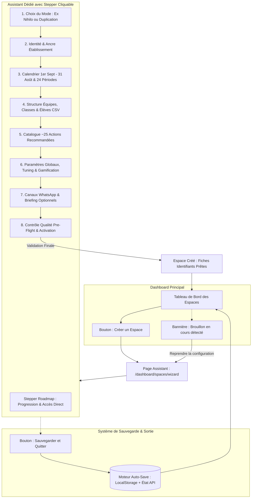

# 📘 Assistant & Guide de Création et Configuration d'un Espace (v2.1)

> **Document de Référence & Spécification Fonctionnelle**  
> **Projet :** SOS Planète v2 / Évoé  
> **Auteurs :** Équipe Produit & Architecture  
> **Statut :** Spécification Validée & Prête pour implémentation  
> **Version :** 2.1.0

---

## 🎯 Objectif et Format de l'Assistant

L'Assistant de Création et Configuration d'Espace est conçu sous la forme d'une **Page Dédiée plein écran (`/dashboard/spaces/wizard`) avec sauvegarde automatique de brouillon**.  
Il permet à un administrateur (`AS`) ou un animateur (`AM`) de :
1. **Créer un espace *Ex Nihilo*** (nouvelle école, première année scolaire, import CSV d'élèves ou saisie directe).
2. **Créer un espace par *Duplication / Report d'Année*** (clonage automatique avec choix de conserver ou non les anciens élèves, décalage temporel automatique des 24 périodes, et réinitialisation propre des scores).
3. **S'interrompre à tout moment** : La progression est automatiquement persistée, permettant de quitter l'assistant pour gérer d'autres espaces, puis de reprendre la configuration via une bannière interactive sur le Dashboard.
4. **Hériter automatiquement des paramètres globaux** : Récupération transparente des constantes mondiales (`AnnualImpactData`) et des poids de tuning de l'année précédente.

---

## 🗺️ Cartographie Globale du Processus & Stepper Interactif

---

## 📋 Comparatif des Deux Modes de Création

| Caractéristique | 🌱 Création Ex Nihilo | 🧬 Création par Duplication |
| :--- | :--- | :--- |
| **Ancre d'Établissement (`Instance`)** | Créée ou rattachée à une existante | Conserve l'ancre existante (`instanceId`) |
| **Millésime (`InstanceYear`)** | Vierge (`isOpen = false`) | Copié depuis `fromSchoolYear` vers `toSchoolYear` |
| **Calendrier & 24 Périodes** | Calculé du 01/09/N au 31/08/N+1 (éditable) | Dates décalées automatiquement de +1 an (éditable) |
| **Paramètres Globaux (`AnnualImpactData`)** | Hérités de l'année précédente ou valeurs système | Hérités automatiquement avec poids de tuning |
| **Équipes & Groupes** | Saisie manuelle ou import CSV | Dupliqués à l'identique (noms, couleurs, icônes) |
| **Élèves / Joueurs** | Import CSV (modèle fourni) ou saisie | **Option au choix :** 1. *Conserver les élèves N-1* 2. *Structure seule (classes vides)* pour ré-import |
| **Catalogue d'Actions** | Pré-sélection de ~25 actions recommandées | Dupliqué avec les personnalisations de l'année précédente |
| **Historique & Scores (`ActionDone`)** | Aucun (vierge) | **Réinitialisé à zéro** (nouvelle saison propre) |
| **Course Éco-Barre & Animaux** | Vierge | **Réinitialisé à zéro** |

---

# 🧙‍♂️ Le Déroulé des 8 Étapes de l'Assistant

Chaque étape dispose en en-tête d'un **cadre descriptif pédagogique** explicitant les attentes et conseils pratiques.

---

### ÉTAPE 1 : Choix du Mode de Création
> 💡 **En-tête pédagogique :** *« Choisissez le point de départ de votre espace. Pour un nouvel établissement, partez de zéro (Ex Nihilo). Pour une école ayant déjà participé, dupliquez la saison passée pour gagner du temps tout en gardant vos réglages. »*

- [ ] **Option A : Création Ex Nihilo** (Établissement vierge).
- [ ] **Option B : Duplication d'une saison existante** (Sélection de l'école et de l'année source N-1 $\rightarrow$ Année cible N).

---

### ÉTAPE 2 : Identité, Ancrage & Gouvernance
> 💡 **En-tête pédagogique :** *« Définissez le nom officiel de l'école, son identifiant unique de connexion et son animateur référent. »*

- [ ] **Nom de l'établissement (`schoolName`) :** Avec autocomplétion des établissements existants pour rattacher une nouvelle année.
- [ ] **Année Scolaire (`schoolYear`) :** ex. `2025-2026`.
- [ ] **Slug / URL d'accès (`hostUrl`) :** URL courte personnalisée (ex: `victor-hugo-2025`).
- [ ] **Logo / Mascotte (`icon`) :** Upload PNG, JPG, WebP.
- [ ] **Animateur Référent (`adminId`) :** Auto-assigné pour un AM, sélectionnable pour un AS.

---

### ÉTAPE 3 : Calendrier, Plage de Dates & 24 Périodes
> 💡 **En-tête pédagogique :** *« Fixez les dates de votre saison de jeu entre le 1er septembre et le 31 août. Le système calcule automatiquement les 24 périodes de jeu, que vous pouvez ajuster manuellement à tout moment. »*

- [ ] **Bornes autorisées :** Du **1er septembre de l'année N au 31 août de l'année N+1**.
- [ ] **Découpage automatique :** Génération des 24 périodes réparties sur la durée globale.
- [ ] **Tableau d'édition manuelle :** Possibilité de modifier ponctuellement la date de début ou de fin d'une période spécifique (ex: ajustement pour vacances scolaires).

---

### ÉTAPE 4 : Structure Organisationnelle & Import des Élèves
> 💡 **En-tête pédagogique :** *« Organisez vos équipes et classes. Vous pouvez importer directement votre liste d'élèves via notre modèle CSV ou les saisir manuellement. »*

- [ ] **Mode Duplication (si applicable) :**
  - Option 1 : *Conserver les élèves et mots de passe de l'année N-1*.
  - Option 2 : *Conserver uniquement les équipes et classes vides* (prêtes pour le nouvel import).
- [ ] **Équipes & Groupes :** Noms, couleurs, icônes.
- [ ] **Import CSV / Excel :**
  - Bouton *« Télécharger le modèle CSV de classe »*.
  - Zone de Drag & Drop de fichier avec prévisualisation immédiate des élèves (nom, pseudo, classe, équipe, délégué).

---

### ÉTAPE 5 : Catalogue d'Actions Écologiques (~25 Recommandées)
> 💡 **En-tête pédagogique :** *« Sélectionnez les écogestes quotidiens que les élèves pourront réaliser. Une sélection d'environ 25 actions recommandées est pré-cochée pour vous faire gagner du temps. »*

- [ ] **Pack de ~25 actions recommandées** pré-sélectionnées par défaut.
- [ ] **Sélecteur visuel par thématique :** Alimentation, Déchets, Énergie, Mobilité, Biodiversité.
- [ ] **Personnalisation locale :** Possibilité d'ajouter ou retirer des actions sans contrainte bloquante, et d'ajuster les coefficients d'impact ($\text{kg CO}_2\text{e}$, Litres d'Eau, etc.).

---

### ÉTAPE 6 : Paramètres Globaux, Tuning & Gamification
> 💡 **En-tête pédagogique :** *« Vérifiez les paramètres de jeu et les constantes d'impact globales. Les données mondiales et le tuning de l'année précédente sont automatiquement appliqués. »*

- [ ] **Constantes globales d'impact (`AnnualImpactData`) :** Récupérées automatiquement de l'année précédente (moyennes monde CO2, eau, déchets, pop, jour du dépassement).
- [ ] **Tuning des critères :** Poids d'assiduité, multiplicateur annuel, facteur de difficulté hérités par défaut.
- [ ] **Paramètres de jeu locaux (`GameConfig`) :**
  - Actions cibles par enfant par période (défaut = 8).
  - Marge d'avance de l'animal mascotte (défaut = +2).
  - Seuil de bienveillance (défaut = 40%).
- [ ] **Chapitres narratifs débloqués (`unlockedChapters`).**

---

### ÉTAPE 7 : Canaux WhatsApp & Briefing Vidéo (Optionnels)
> 💡 **En-tête pédagogique :** *« Intégrez des canaux de communication pour animer le défi auprès des parents et capitaines d'équipe. Cette étape est facultative. »*

- [ ] **Lien Communauté WhatsApp Générale** (facultatif).
- [ ] **Liens d'invitation des groupes d'équipes** (facultatif).
- [ ] **URL du Briefing Vidéo YouTube** (vidéo d'introduction de saison).

---

### ÉTAPE 8 : Bilan Qualité Pre-Flight, Export & Activation
> 💡 **En-tête pédagogique :** *« Vérifiez la synthèse de votre espace avant de le valider. Vous pouvez le conserver en brouillon ou l'ouvrir immédiatement aux élèves. »*

- [ ] **Checklist de Conformité :** Périodes valides, au moins 1 équipe et des élèves enregistrés, catalogue configuré.
- [ ] **Bouton d'Enregistrement :**
  - *« Enregistrer en Brouillon »* (`isOpen = false` par défaut).
  - *« Ouvrir l'espace dès maintenant »* (`isOpen = true`).
- [ ] **Impression des Fiches de Connexion :** Bouton pour générer et imprimer les étiquettes / fiches de connexion avec identifiants élèves et QR codes.
